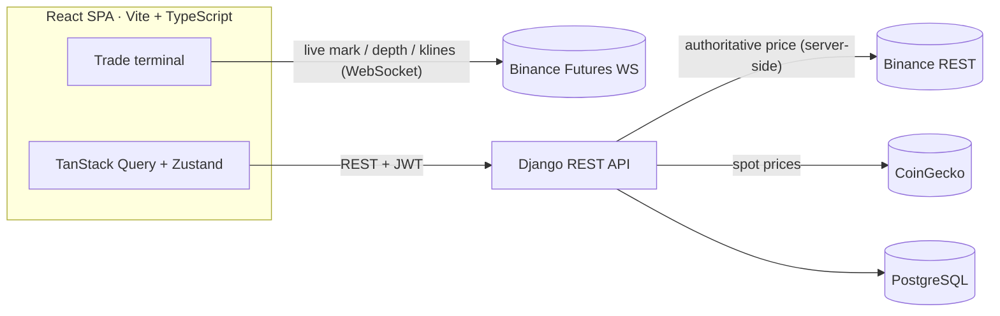

<div align="center">

# ⚡ CryptoFlow

### A real-time, server-authoritative crypto **futures trading simulator**

Live Binance order books and candlesticks · leverage up to 125× · paper money · zero risk.

[**Live demo**](https://cryptofloww.netlify.app) · `demo / demodemo123`  ·  [Engineering decisions →](./docs/DECISIONS.md)


</div>

> _Replace this line with a hero GIF of the Trade terminal — a leveraged position opening and the PnL flashing live._

---

## What it is

CryptoFlow is a full-stack trading terminal that streams **live market data** straight from Binance and lets you trade **perpetual futures** and **spot** with simulated money. The frontend feels like a real exchange (Hyperliquid/Bybit lineage); the backend is a **server-authoritative engine** where every price is settled server-side and every balance mutation is concurrency-safe.

It started as a coding-bootcamp project and was rebuilt into a production-grade portfolio piece. The interesting engineering isn't "crypto" — it's **real-time WebSocket fan-in, server-settled financial math, and DB-level concurrency control**.

## Highlights

- 📈 **Live trading terminal** — TradingView `lightweight-charts` candles, a depth-shaded order-book ladder, and a mark price that **flashes and rolls on every tick** (`@number-flow/react`).
- 🔌 **Direct Binance WebSocket feeds** — mark price, depth-20 (100 ms) and live klines, with auto-reconnect, backoff, and a staleness watchdog so the UI never silently lies.
- ⚙️ **Server-authoritative engine** — leverage 1–125×, long/short, PnL & liquidation math computed **server-side**; client-supplied prices are ignored by design.
- 🔒 **Concurrency-safe money** — every wallet mutation runs in `transaction.atomic()` + `select_for_update()` with DB `CHECK (balance >= 0)` constraints.
- 💼 **Spot + portfolio** — buy / sell / convert with a live allocation donut, powered by CoinGecko.
- 🎨 **One design system** — Tailwind v4 token system, a Radix/shadcn-style UI kit, tabular-figure pricing, full keyboard/focus accessibility, responsive down to mobile.

## Tech stack

| Layer | Tech |
|---|---|
| **Frontend** | React 19 · TypeScript · Vite · Tailwind CSS v4 · Radix UI · TanStack Query · Zustand · `motion` + `@number-flow/react` · lightweight-charts · Recharts · react-hook-form + Zod · sonner |
| **Backend** | Django 5 · Django REST Framework · SimpleJWT · `transaction.atomic` + `select_for_update` · drf-spectacular (OpenAPI) · DRF throttling |
| **Data** | Binance USDⓈ-M Futures (WS + REST) · CoinGecko |
| **Infra** | PostgreSQL · WhiteNoise · gunicorn · `dj-database-url` |

## Architecture



Market data streams **browser → Binance** directly (low latency, no backend fan-out cost). Anything that touches **money** — opening/closing positions, wallet balances, settlement — goes through the Django API, which fetches its own authoritative price and writes under a row lock.

## Quick start

**Prerequisites:** Python 3.12+, Node 20+.

```bash
# 1. Backend
cd backend
python -m venv venv && source venv/bin/activate
pip install -r ../requirements.txt
cp .env.example .env        # then fill in the values
python manage.py migrate
python manage.py seed_demo  # creates the demo account + sample positions
python manage.py runserver

# 2. Frontend (in a second terminal)
cd frontend
npm install
cp .env.example .env        # VITE_API_BASE=http://127.0.0.1:8000/api
npm run dev                 # http://localhost:5173
```

Open <http://localhost:5173> and click **“Try the live demo”** (or sign up for a fresh $10,000 paper account).

API docs (Swagger UI) are served at <http://127.0.0.1:8000/api/docs/>.

## Environment

See [`backend/.env.example`](./backend/.env.example) and [`frontend/.env.example`](./frontend/.env.example). Key variables:

| Variable | Where | Notes |
|---|---|---|
| `SECRET_KEY` | backend | Required when `DEBUG=False`. |
| `DEBUG` | backend | Defaults to `False` (fail-closed). |
| `DATABASE_URL` | backend | Postgres in prod; falls back to SQLite locally. |
| `COINGECKO_API_KEY` | backend | Spot market data. |
| `VITE_API_BASE` | frontend | Base URL of the API. |

## Tests

```bash
cd backend && pytest        # incl. a concurrency test proving the wallet can't be double-spent
cd frontend && npm test     # component + formatting unit tests
```

## Disclaimer

CryptoFlow is a **paper-trading simulator for educational purposes**. No real funds are involved and nothing here is financial advice.

## License

[MIT](./LICENSE) © Pavle Tosic
